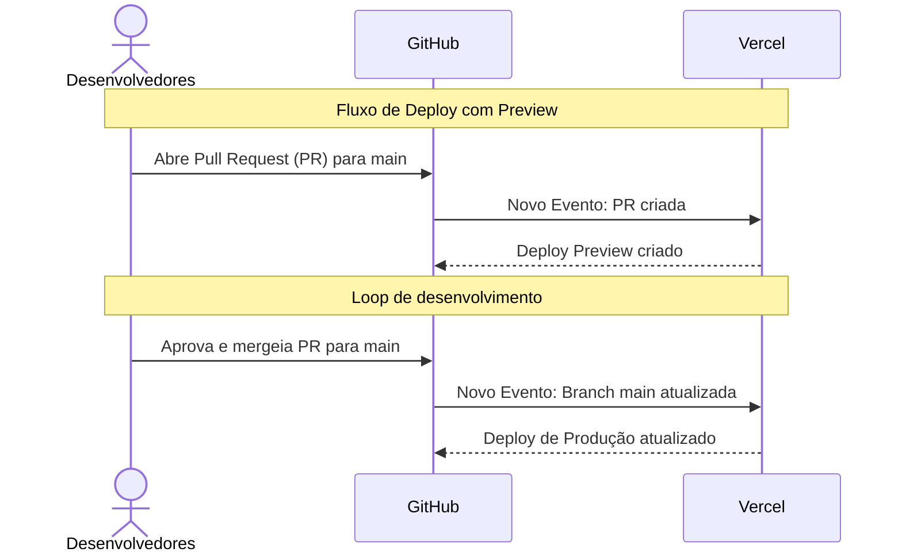

# mentores-frontend

Projeto Opensource que visa melhorar o match entre Mentores e Juniors.

## Observação:

> Antes de iniciar a instalação, lembre-se de fazer um fork do repositório oficial e realizar as alterações no repositório "forkado" enviando modificações através de Pull Requests. Nunca modifique diretamente o repositório oficial.

Clone o projeto:

```bash
  git clone https://github.com/{SEU USUARIO}/mentores-frontend.git
```

Entre no diretório do projeto:

```bash
  cd mentores-frontend/
```

Instale as dependências:

```bash
  npm install
```

## Rodando localmente

Inicie o servidor:

```bash
npm run dev
# ou
yarn dev
# ou
pnpm dev
```

## Tecnologias utilizadas

    

## DevOps


